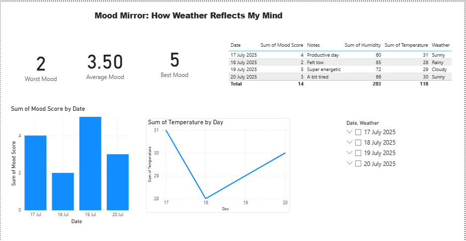

# MoodMirror 🧠🌦️ – Mood vs Weather Power BI Dashboard

**MoodMirror** is an interactive Power BI dashboard that reveals how daily weather conditions may influence emotional well-being.

## 📌 Project Goal
To analyze the correlation between mood swings and environmental factors like temperature, humidity, and weather type.

## 📊 Data Used
- `MoodData.xlsx`: Daily mood ratings and notes
- `WeatherData.xlsx`: Temperature, humidity, and weather type

## 🔧 Tools
- Power BI Desktop
- Excel
- DAX for smart calculations

## 💡 Visuals Included
- Line chart of Mood Over Time  
- Line chart of Temperature Over Time  
- Scatter plot: Mood vs Temperature  
- Summary Table: Mood + Weather + Notes  
- KPI Cards: Average Mood, Best & Worst Mood  
- Slicers to filter by date or weather condition

## 📸 Preview

## ✅ Key Insights
- Average mood score was 3.5 across 4 days
- Mood peaked on July 19th when it was cloudy
- Lower mood observed on rainy days

## 📁 Files Included
- `MoodData.xlsx`
- `WeatherData.xlsx`
- `moodmirror-preview.png`
- `README.md`

## 🚀 How to View
Open the `.pbix` file in Power BI Desktop or recreate by importing the Excel sheets and linking by `Date`.

---

> Designed with ♥ by [Santhiya Diya](https://github.com/SanthiyaBaskar)
